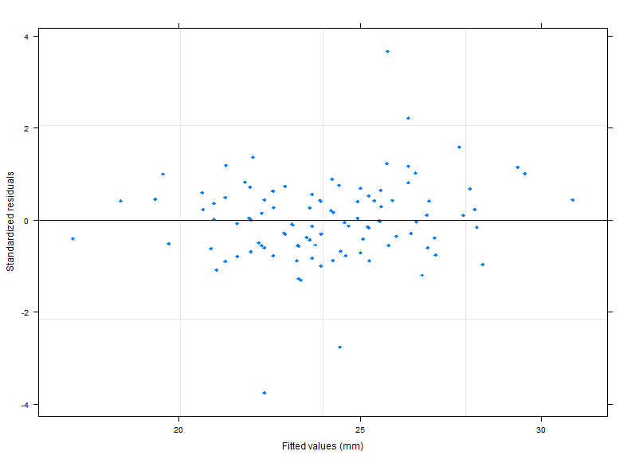
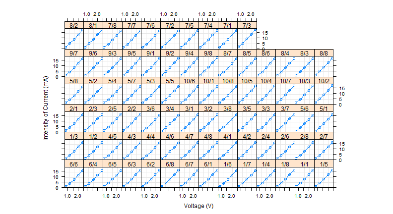

Linear Mixed Effects Models with R
========================================================


```r
library(nlme)
```

### Orthodont Data Set
Growth curve data on an orthdontic measurement.

```r
tail(Orthodont)
```

```
## Grouped Data: distance ~ age | Subject
##     distance age Subject    Sex
## 103     19.0  12     F10 Female
## 104     19.5  14     F10 Female
## 105     24.5   8     F11 Female
## 106     25.0  10     F11 Female
## 107     28.0  12     F11 Female
## 108     28.0  14     F11 Female
```

```r
summary(Orthodont)
```

```
##     distance         age          Subject       Sex    
##  Min.   :16.5   Min.   : 8.0   M16    : 4   Male  :64  
##  1st Qu.:22.0   1st Qu.: 9.5   M05    : 4   Female:44  
##  Median :23.8   Median :11.0   M02    : 4              
##  Mean   :24.0   Mean   :11.0   M11    : 4              
##  3rd Qu.:26.0   3rd Qu.:12.5   M07    : 4              
##  Max.   :31.5   Max.   :14.0   M08    : 4              
##                                (Other):84
```

```r
mode(Orthodont)
```

```
## [1] "list"
```

```r
class(Orthodont)
```

```
## [1] "nfnGroupedData" "nfGroupedData"  "groupedData"    "data.frame"
```

```r
formula(Orthodont)
```

```
## distance ~ age | Subject
```


```r
plot(Orthodont)
```

 

### Wafer Data Set


```r
tail(Wafer)
```

```
## Grouped Data: current ~ voltage | Wafer/Site
##     Wafer Site voltage current
## 395    10    7     2.4  16.968
## 396    10    8     0.8   1.151
## 397    10    8     1.2   4.322
## 398    10    8     1.6   8.232
## 399    10    8     2.0  12.440
## 400    10    8     2.4  16.744
```

```r
summary(Wafer)
```

```
##      Wafer          Site        voltage       current      
##  1      : 40   1      : 50   Min.   :0.8   Min.   : 0.782  
##  2      : 40   2      : 50   1st Qu.:1.2   1st Qu.: 3.926  
##  3      : 40   3      : 50   Median :1.6   Median : 7.959  
##  4      : 40   4      : 50   Mean   :1.6   Mean   : 8.355  
##  5      : 40   5      : 50   3rd Qu.:2.0   3rd Qu.:12.441  
##  6      : 40   6      : 50   Max.   :2.4   Max.   :17.786  
##  (Other):160   (Other):100
```

```r
# Five measurements for each cobination of Wafer and Site
table(Wafer$Wafer, Wafer$Site)
```

```
##     
##      1 2 3 4 5 6 7 8
##   1  5 5 5 5 5 5 5 5
##   2  5 5 5 5 5 5 5 5
##   3  5 5 5 5 5 5 5 5
##   4  5 5 5 5 5 5 5 5
##   5  5 5 5 5 5 5 5 5
##   6  5 5 5 5 5 5 5 5
##   7  5 5 5 5 5 5 5 5
##   8  5 5 5 5 5 5 5 5
##   9  5 5 5 5 5 5 5 5
##   10 5 5 5 5 5 5 5 5
```


```r
plot(Wafer)
```

 

